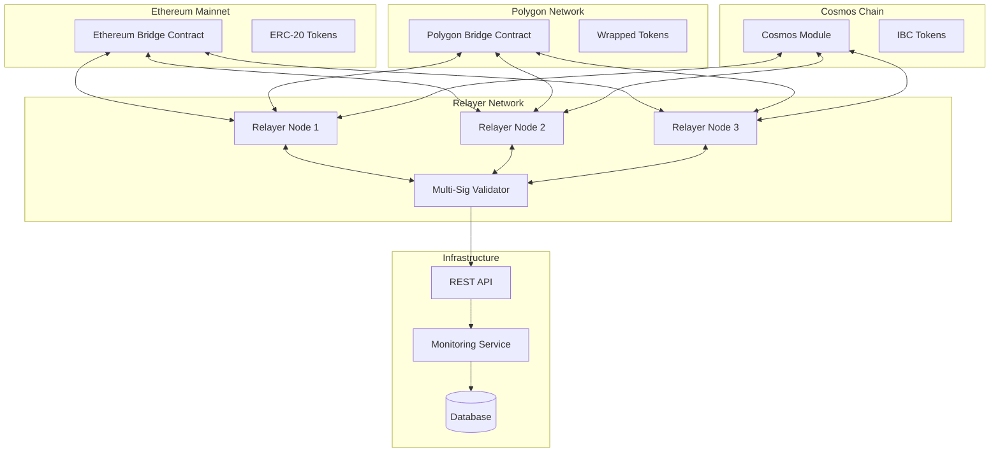

# NexusBridge Design Document

## Overview

NexusBridge is a multi-chain interoperability protocol that enables secure asset transfers between Ethereum, Polygon (Layer 2), and Cosmos-based chains. The system employs a hub-and-spoke architecture where smart contracts handle asset custody and a distributed relayer network facilitates cross-chain communication using cryptographic proofs and multi-signature validation.

The architecture consists of three primary layers:

- **Contract Layer**: Smart contracts deployed on each supported chain for asset custody and event emission
- **Relayer Layer**: Go-based services that monitor events and execute cross-chain transactions
- **API Layer**: REST endpoints and monitoring infrastructure for user interaction and system observability

## Architecture

### High-Level Architecture



### Component Architecture

The system follows a modular design with clear separation of concerns:

1. **Chain Adapters**: Abstract interfaces for different blockchain interactions
2. **Event Processors**: Handle blockchain event monitoring and parsing
3. **Signature Validators**: Manage multi-signature verification and consensus
4. **Transaction Executors**: Execute cross-chain transactions with retry logic
5. **State Managers**: Track transfer states and prevent double-spending

## Components and Interfaces

### Smart Contracts

#### Ethereum Bridge Contract (Solidity)

**Purpose**: Manages token locking/unlocking on Ethereum mainnet

**Key Functions**:

- `lockTokens(address token, uint256 amount, uint256 destinationChain, address recipient)`: Locks ERC-20 tokens and emits Lock event
- `unlockTokens(bytes32 transferId, address token, uint256 amount, address recipient, bytes[] signatures)`: Releases locked tokens with multi-sig validation
- `addSupportedToken(address token)`: Adds new ERC-20 token support
- `updateRelayerSet(address[] relayers, uint256 threshold)`: Updates authorized relayer addresses

**Events**:

- `TokensLocked(bytes32 indexed transferId, address indexed user, address token, uint256 amount, uint256 destinationChain, address recipient)`
- `TokensUnlocked(bytes32 indexed transferId, address indexed recipient, address token, uint256 amount)`

**Security Features**:

- Multi-signature validation for unlock operations
- Reentrancy protection using OpenZeppelin's ReentrancyGuard
- Pausable functionality for emergency stops
- Role-based access control for administrative functions

#### Polygon Bridge Contract (Solidity)

**Purpose**: Manages token minting/burning on Polygon network

**Key Functions**:

- `mintTokens(bytes32 transferId, address token, uint256 amount, address recipient, bytes[] signatures)`: Mints wrapped tokens
- `burnTokens(address token, uint256 amount, uint256 destinationChain, address recipient)`: Burns tokens for cross-chain transfer
- `deployWrappedToken(address originalToken, string name, string symbol)`: Creates wrapped token contracts

**Events**:

- `TokensMinted(bytes32 indexed transferId, address indexed recipient, address token, uint256 amount)`
- `TokensBurned(bytes32 indexed transferId, address indexed user, address token, uint256 amount, uint256 destinationChain, address recipient)`

#### Cosmos Bridge Module (Go + Cosmos SDK)

**Purpose**: Handles IBC transfers and token management on Cosmos chains

**Key Components**:

- `IBCTransferHandler`: Manages IBC packet creation and processing
- `TokenRegistry`: Tracks supported tokens and their denominations
- `ValidatorSet`: Manages relayer consensus for Cosmos-specific operations

**Messages**:

- `MsgLockTokens`: Locks tokens for cross-chain transfer
- `MsgUnlockTokens`: Unlocks tokens from other chains
- `MsgUpdateRelayers`: Updates authorized relayer set

### Relayer Service (Go)

#### Core Interfaces

```go
// ChainAdapter defines the interface for blockchain interactions
type ChainAdapter interface {
    Connect(ctx context.Context, config ChainConfig) error
    ListenForEvents(ctx context.Context, eventChan chan<- Event) error
    SubmitTransaction(ctx context.Context, tx Transaction) (*TxResult, error)
    GetBlockConfirmations(ctx context.Context, txHash string) (uint64, error)
    ValidateEvent(ctx context.Context, event Event) error
}

// SignatureValidator handles multi-signature operations
type SignatureValidator interface {
    SignTransfer(transferID string, transfer Transfer) (*Signature, error)
    ValidateSignatures(transferID string, signatures []Signature) error
    GetRequiredThreshold() uint64
}

// StateManager tracks transfer states
type StateManager interface {
    RecordTransfer(ctx context.Context, transfer Transfer) error
    GetTransferStatus(ctx context.Context, transferID string) (*TransferStatus, error)
    MarkTransferComplete(ctx context.Context, transferID string) error
    IsTransferProcessed(ctx context.Context, transferID string) (bool, error)
}
```

#### Event Processing Pipeline

```go
type EventProcessor struct {
    chainAdapters    map[ChainID]ChainAdapter
    signatureValidator SignatureValidator
    stateManager     StateManager
    eventQueue       chan Event
    workerPool       *WorkerPool
}

func (ep *EventProcessor) ProcessEvent(ctx context.Context, event Event) error {
    // 1. Validate event authenticity
    if err := ep.validateEvent(event); err != nil {
        return fmt.Errorf("event validation failed: %w", err)
    }

    // 2. Check if already processed
    if processed, err := ep.stateManager.IsTransferProcessed(ctx, event.TransferID); err != nil {
        return err
    } else if processed {
        return ErrAlreadyProcessed
    }

    // 3. Generate signature
    signature, err := ep.signatureValidator.SignTransfer(event.TransferID, event.Transfer)
    if err != nil {
        return fmt.Errorf("signature generation failed: %w", err)
    }

    // 4. Collect signatures from other relayers
    signatures, err := ep.collectSignatures(ctx, event.TransferID)
    if err != nil {
        return fmt.Errorf("signature collection failed: %w", err)
    }

    // 5. Execute cross-chain transaction
    return ep.executeTransfer(ctx, event, signatures)
}
```

### REST API Service

#### API Endpoints

**Transfer Management**:

- `POST /api/v1/transfers`: Initiate cross-chain transfer
- `GET /api/v1/transfers/{id}`: Get transfer status
- `GET /api/v1/transfers`: List transfers with pagination

**System Information**:

- `GET /api/v1/chains`: List supported chains and their status
- `GET /api/v1/tokens`: List supported tokens per chain
- `GET /api/v1/fees`: Get current fee estimates

**Monitoring**:

- `GET /api/v1/health`: System health check
- `GET /api/v1/metrics`: Prometheus metrics endpoint
- `GET /api/v1/relayers`: Relayer network status

#### API Models

```go
type TransferRequest struct {
    SourceChain      ChainID `json:"source_chain" validate:"required"`
    DestinationChain ChainID `json:"destination_chain" validate:"required"`
    Token           string  `json:"token" validate:"required,eth_addr"`
    Amount          string  `json:"amount" validate:"required,numeric"`
    Recipient       string  `json:"recipient" validate:"required"`
    UserAddress     string  `json:"user_address" validate:"required"`
}

type TransferResponse struct {
    TransferID      string    `json:"transfer_id"`
    Status          string    `json:"status"`
    SourceTxHash    string    `json:"source_tx_hash,omitempty"`
    DestinationTxHash string  `json:"destination_tx_hash,omitempty"`
    Confirmations   uint64    `json:"confirmations"`
    EstimatedTime   int64     `json:"estimated_completion_seconds"`
    CreatedAt       time.Time `json:"created_at"`
    UpdatedAt       time.Time `json:"updated_at"`
}
```

## Data Models

### Core Transfer Model

```go
type Transfer struct {
    ID               string    `json:"id" db:"id"`
    SourceChain      ChainID   `json:"source_chain" db:"source_chain"`
    DestinationChain ChainID   `json:"destination_chain" db:"destination_chain"`
    Token            string    `json:"token" db:"token"`
    Amount           *big.Int  `json:"amount" db:"amount"`
    Sender           string    `json:"sender" db:"sender"`
    Recipient        string    `json:"recipient" db:"recipient"`
    Status           TransferStatus `json:"status" db:"status"`
    SourceTxHash     string    `json:"source_tx_hash" db:"source_tx_hash"`
    DestinationTxHash string   `json:"destination_tx_hash" db:"destination_tx_hash"`
    BlockNumber      uint64    `json:"block_number" db:"block_number"`
    Confirmations    uint64    `json:"confirmations" db:"confirmations"`
    Signatures       []Signature `json:"signatures" db:"signatures"`
    CreatedAt        time.Time `json:"created_at" db:"created_at"`
    UpdatedAt        time.Time `json:"updated_at" db:"updated_at"`
}

type TransferStatus string

const (
    StatusPending     TransferStatus = "pending"
    StatusConfirming  TransferStatus = "confirming"
    StatusSigned      TransferStatus = "signed"
    StatusExecuting   TransferStatus = "executing"
    StatusCompleted   TransferStatus = "completed"
    StatusFailed      TransferStatus = "failed"
)
```

### Chain Configuration Model

```go
type ChainConfig struct {
    ChainID          ChainID `json:"chain_id"`
    Name             string  `json:"name"`
    Type             ChainType `json:"type"` // ethereum, cosmos
    RPC              string  `json:"rpc"`
    WSS              string  `json:"wss,omitempty"`
    BridgeContract   string  `json:"bridge_contract"`
    RequiredConfirmations uint64 `json:"required_confirmations"`
    BlockTime        time.Duration `json:"block_time"`
    GasLimit         uint64  `json:"gas_limit"`
    GasPrice         *big.Int `json:"gas_price"`
    Enabled          bool    `json:"enabled"`
}
```

### Database Schema

```sql
-- Transfers table
CREATE TABLE transfers (
    id VARCHAR(66) PRIMARY KEY,
    source_chain INTEGER NOT NULL,
    destination_chain INTEGER NOT NULL,
    token VARCHAR(42) NOT NULL,
    amount DECIMAL(78,0) NOT NULL,
    sender VARCHAR(42) NOT NULL,
    recipient VARCHAR(42) NOT NULL,
    status VARCHAR(20) NOT NULL,
    source_tx_hash VARCHAR(66),
    destination_tx_hash VARCHAR(66),
    block_number BIGINT,
    confirmations INTEGER DEFAULT 0,
    created_at TIMESTAMP DEFAULT CURRENT_TIMESTAMP,
    updated_at TIMESTAMP DEFAULT CURRENT_TIMESTAMP
);

-- Signatures table
CREATE TABLE signatures (
    id SERIAL PRIMARY KEY,
    transfer_id VARCHAR(66) REFERENCES transfers(id),
    relayer_address VARCHAR(42) NOT NULL,
    signature BYTEA NOT NULL,
    created_at TIMESTAMP DEFAULT CURRENT_TIMESTAMP
);

-- Supported tokens table
CREATE TABLE supported_tokens (
    id SERIAL PRIMARY KEY,
    chain_id INTEGER NOT NULL,
    token_address VARCHAR(42) NOT NULL,
    name VARCHAR(100) NOT NULL,
    symbol VARCHAR(20) NOT NULL,
    decimals INTEGER NOT NULL,
    is_native BOOLEAN DEFAULT FALSE,
    enabled BOOLEAN DEFAULT TRUE,
    UNIQUE(chain_id, token_address)
);
```

## Error Handling

### Error Categories

1. **Validation Errors**: Invalid input parameters, unsupported tokens/chains
2. **Network Errors**: RPC failures, connection timeouts, chain unavailability
3. **Consensus Errors**: Insufficient signatures, relayer disagreements
4. **Execution Errors**: Transaction failures, insufficient gas, contract reverts
5. **State Errors**: Double-spending attempts, invalid state transitions

### Error Recovery Strategies

```go
type ErrorHandler struct {
    retryConfig RetryConfig
    alerting    AlertingService
    metrics     MetricsCollector
}

func (eh *ErrorHandler) HandleError(ctx context.Context, err error, operation string) error {
    // Classify error type
    errorType := eh.classifyError(err)

    // Record metrics
    eh.metrics.IncrementErrorCounter(operation, errorType)

    switch errorType {
    case NetworkError:
        return eh.handleNetworkError(ctx, err, operation)
    case ConsensusError:
        return eh.handleConsensusError(ctx, err, operation)
    case ExecutionError:
        return eh.handleExecutionError(ctx, err, operation)
    default:
        eh.alerting.SendAlert(AlertCritical, fmt.Sprintf("Unhandled error in %s: %v", operation, err))
        return err
    }
}

func (eh *ErrorHandler) handleNetworkError(ctx context.Context, err error, operation string) error {
    // Implement exponential backoff retry
    backoff := eh.retryConfig.InitialBackoff
    for attempt := 0; attempt < eh.retryConfig.MaxRetries; attempt++ {
        select {
        case <-ctx.Done():
            return ctx.Err()
        case <-time.After(backoff):
            // Retry operation
            if retryErr := eh.retryOperation(ctx, operation); retryErr == nil {
                return nil
            }
            backoff *= 2
        }
    }

    // Send alert after max retries exceeded
    eh.alerting.SendAlert(AlertHigh, fmt.Sprintf("Network error in %s after %d retries: %v",
        operation, eh.retryConfig.MaxRetries, err))
    return err
}
```

### Chain Reorganization Handling

```go
type ReorgHandler struct {
    stateManager StateManager
    chainAdapters map[ChainID]ChainAdapter
}

func (rh *ReorgHandler) HandleReorganization(ctx context.Context, chainID ChainID, reorgDepth uint64) error {
    // 1. Identify affected transfers
    affectedTransfers, err := rh.stateManager.GetTransfersInBlockRange(ctx, chainID, reorgDepth)
    if err != nil {
        return fmt.Errorf("failed to get affected transfers: %w", err)
    }

    // 2. Revalidate each affected transfer
    for _, transfer := range affectedTransfers {
        if err := rh.revalidateTransfer(ctx, transfer); err != nil {
            log.Errorf("Failed to revalidate transfer %s: %v", transfer.ID, err)
            // Mark transfer for manual review
            rh.stateManager.MarkTransferForReview(ctx, transfer.ID, err.Error())
        }
    }

    return nil
}
```

## Testing Strategy

### Unit Testing

**Smart Contract Tests (Foundry)**:

- Test all contract functions with various input scenarios
- Verify event emission and parameter correctness
- Test access control and security mechanisms
- Simulate attack scenarios (reentrancy, overflow, etc.)

```solidity
// Example Foundry test
contract BridgeContractTest is Test {
    BridgeContract bridge;
    MockERC20 token;

    function setUp() public {
        bridge = new BridgeContract();
        token = new MockERC20("Test Token", "TEST", 18);
    }

    function testLockTokens() public {
        uint256 amount = 1000e18;
        token.mint(address(this), amount);
        token.approve(address(bridge), amount);

        vm.expectEmit(true, true, true, true);
        emit TokensLocked(
            keccak256(abi.encodePacked(block.timestamp, address(this), amount)),
            address(this),
            address(token),
            amount,
            137, // Polygon chain ID
            address(this)
        );

        bridge.lockTokens(address(token), amount, 137, address(this));

        assertEq(token.balanceOf(address(bridge)), amount);
    }
}
```

**Go Service Tests**:

- Mock blockchain interactions using interfaces
- Test event processing pipeline with various scenarios
- Verify signature validation and multi-sig consensus
- Test error handling and recovery mechanisms

```go
func TestEventProcessor_ProcessLockEvent(t *testing.T) {
    // Setup mocks
    mockChainAdapter := &MockChainAdapter{}
    mockSignatureValidator := &MockSignatureValidator{}
    mockStateManager := &MockStateManager{}

    processor := &EventProcessor{
        chainAdapters:      map[ChainID]ChainAdapter{ChainEthereum: mockChainAdapter},
        signatureValidator: mockSignatureValidator,
        stateManager:      mockStateManager,
    }

    // Test data
    event := Event{
        Type:       EventTypeLock,
        TransferID: "0x123...",
        Transfer: Transfer{
            SourceChain:      ChainEthereum,
            DestinationChain: ChainPolygon,
            Amount:          big.NewInt(1000),
            Token:           "0xA0b86a33E6441E6C7D3E4C2C4C6C6C6C6C6C6C6C",
        },
    }

    // Setup expectations
    mockStateManager.On("IsTransferProcessed", mock.Anything, event.TransferID).Return(false, nil)
    mockSignatureValidator.On("SignTransfer", event.TransferID, event.Transfer).Return(&Signature{}, nil)

    // Execute test
    err := processor.ProcessEvent(context.Background(), event)

    // Verify results
    assert.NoError(t, err)
    mockStateManager.AssertExpectations(t)
    mockSignatureValidator.AssertExpectations(t)
}
```

### Integration Testing

**Cross-Chain Flow Tests**:

- Deploy contracts on local testnets (Hardhat, Cosmos testnet)
- Test complete transfer flows between different chains
- Verify proper event emission and processing
- Test failure scenarios and recovery

**Performance Tests**:

- Load testing with multiple concurrent transfers
- Measure transaction throughput and latency
- Test system behavior under high gas price conditions
- Verify proper resource utilization and scaling

### Security Testing

**Smart Contract Auditing**:

- Static analysis using Slither and MythX
- Formal verification of critical functions
- Gas optimization analysis
- Third-party security audit

**Relayer Security Tests**:

- Test signature validation edge cases
- Verify proper key management and rotation
- Test resistance to various attack vectors
- Penetration testing of API endpoints

## Deployment Architecture

### Infrastructure Components

**Kubernetes Deployment**:

```yaml
apiVersion: apps/v1
kind: Deployment
metadata:
  name: nexus-bridge-relayer
spec:
  replicas: 3
  selector:
    matchLabels:
      app: nexus-bridge-relayer
  template:
    metadata:
      labels:
        app: nexus-bridge-relayer
    spec:
      containers:
        - name: relayer
          image: nexusbridge/relayer:latest
          env:
            - name: DATABASE_URL
              valueFrom:
                secretKeyRef:
                  name: bridge-secrets
                  key: database-url
            - name: ETHEREUM_RPC
              valueFrom:
                configMapKeyRef:
                  name: bridge-config
                  key: ethereum-rpc
          resources:
            requests:
              memory: "512Mi"
              cpu: "250m"
            limits:
              memory: "1Gi"
              cpu: "500m"
```

**Monitoring Stack**:

- Prometheus for metrics collection
- Grafana for visualization and alerting
- Jaeger for distributed tracing
- ELK stack for log aggregation

### Security Considerations

**Key Management**:

- Hardware Security Modules (HSM) for production keys
- Key rotation procedures and emergency protocols
- Multi-signature wallet setup for contract ownership
- Secure key derivation and storage practices

**Network Security**:

- VPN connections between relayer nodes
- TLS encryption for all communications
- Rate limiting and DDoS protection
- Regular security updates and patches

**Operational Security**:

- Role-based access control for infrastructure
- Audit logging for all administrative actions
- Incident response procedures
- Regular security assessments and penetration testing
